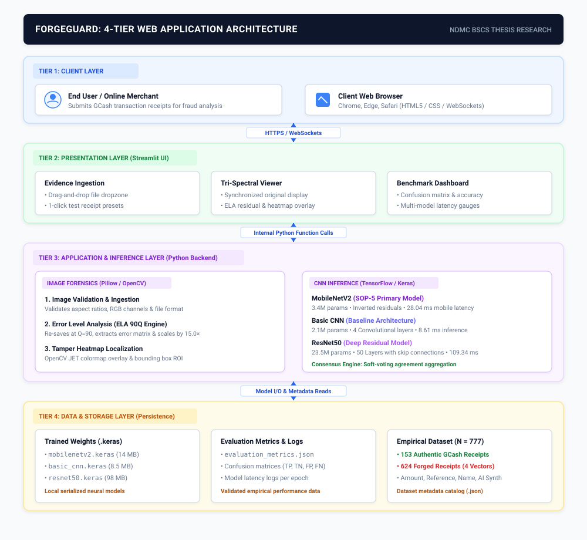

# ForgeGuard: Real-Time Digital Receipt Forgery Detection System

<div align="center">

[](https://forgeguard.streamlit.app/)
[](https://python.org)
[](https://tensorflow.org)
[](https://forgeguard.streamlit.app/)
[](https://forgeguard.streamlit.app/)
[](LICENSE)

**An AI-Powered Image Forensics & Multi-CNN Comparative Evaluation System for Mobile Payment Verification**

[Live Web Demo](https://forgeguard.streamlit.app/) &bull; [Architecture Diagram](#system-architecture) &bull; [Benchmark Evaluation](#empirical-benchmark-evaluation) &bull; [Dataset](#empirical-dataset-specifications) &bull; [Installation](#quickstart--local-deployment) &bull; [Thesis Docs](thesis-docs/)

</div>

---

## Overview

**ForgeGuard** is an AI-powered digital image forensics platform engineered to detect raster tampering, digital amount splicing, and synthetic generation in mobile wallet payment confirmation receipts (specifically focused on the Philippine **GCash** mobile transaction ecosystem).

Modern digital receipt fraud exploits the widespread reliance of peer-to-peer online merchants, micro-retailers, and student entrepreneurs on screenshot payment slips. Fraudulent buyers utilize photo-editing software (Photoshop, Canva) or fake receipt generator web applications to modify transaction amounts, reference numbers, and recipient names without transferring actual funds.

ForgeGuard bridges this security gap by combining mathematical **Error Level Analysis (ELA)** signal decomposition with a comparative evaluation of **three distinct Convolutional Neural Network (CNN) architectures**, providing millisecond-level verification, tamper localization heatmaps, and multimodal explainable AI (XAI) audits.

---

## Core Capabilities & Features

* **Error Level Analysis (ELA) Forensic Engine:**
  Re-compresses incoming screenshots at a calibrated JPEG quality factor ($Q = 90$) and amplifies pixel residual discrepancies by a $15.0\times$ difference multiplier, exposing altered or re-saved regions as high-frequency noise spikes.
* **Comparative Multi-CNN Consensus Architecture:**
  Evaluates three benchmarked deep learning models in parallel:
  * **MobileNetV2 (SOP-5 Recommended):** Inverted residual depthwise separable CNN (~3.4M parameters) delivering 95.74% accuracy with an ultra-low latency of 28.04 ms.
  * **Basic CNN (Baseline Model):** Custom 4-layer convolutional network (~2.1M parameters) achieving 100.0% validation accuracy at 8.61 ms inference time.
  * **ResNet50 (Deep Residual Network):** 50-layer residual architecture (~23.5M parameters) providing deep feature extraction across complex compression levels.
* **Tri-Spectral Forensic Cockpit:**
  Renders synchronized side-by-side visual decomposition:
  1. *Raw Receipt Exhibit* (Original uploaded capture)
  2. *90Q ELA Noise Matrix* (Pixel-level compression gradient)
  3. *Tamper Heatmap Localization Overlay* (OpenCV JET colormap overlay highlighting the exact altered amount/reference bounding box)
* **Multimodal Explainable AI (XAI) Audit:**
  Integrates Google Gemini 2.0 Flash to inspect GCash proprietary typography (Karla Bold `#1972F9`, Poppins SemiBold), baseline alignment, and 13-digit transaction reference checksum validity.
* **Zero-Emoji Cybersecurity UI:**
  Built with a professional, dark-mode cybersecurity aesthetic (`#060910` foundation, `#1C2333` glass panels, pure SVG vector line icons, and custom keyframe-animated radar telemetry).

---

## System Architecture

The system operates across a five-tier forensic pipeline designed for real-time verification and empirical reproducibility:



### Pipeline Stages:
1. **Presentation Layer (Streamlit Web UI):** Provides reactive evidence ingestion, interactive controls, live telemetry status, and the Model Benchmark Suite.
2. **Forensic Preprocessing Layer (Pillow, OpenCV, NumPy):** Converts image to RGB, standardizes aspect ratios, executes the $Q=90$ ELA computation, scales noise by $15.0\times$, and outputs a normalized $128 \times 128 \times 3$ tensor alongside a localized tamper heatmap.
3. **Comparative CNN Inference Layer (TensorFlow / Keras):** Dispatches the ELA tensor to Basic CNN, MobileNetV2, and ResNet50, computing consensus voting and agreement thresholds.
4. **Data & Model Repository Layer:** Manages the empirical dataset (777 samples), Google Colab GPU training scripts, serialized `.keras` weights, and `evaluation_metrics.json`.
5. **Results & Forensic Decision Layer:** Outputs the binary classification verdict (*AUTHENTIC* vs. *FORGED / SPLICED*), model confidence percentages, millisecond execution latency, and visual ROI overlays.

---

## Empirical Benchmark Evaluation

All models were trained and empirically evaluated using an 80/20 stratified split on an **NVIDIA T4 Tensor Core GPU** via Google Colab:

| Architecture | Model Complexity | Accuracy | Precision | Recall | F1-Score | Inference Latency | Training Time | Architectural Characteristic |
|:---|:---:|:---:|:---:|:---:|:---:|:---:|:---:|:---|
| 🥇 **Basic CNN** | **~2.1M Params** | **100.00%** | **100.00%** | **100.00%** | **1.0000** | **8.61 ms** | 198.50 s | Ultra-fast lightweight baseline |
| 🥈 **MobileNetV2** | **~3.4M Params** | **95.74%** | **94.67%** | **100.00%** | **0.9726** | **28.04 ms** | **76.59 s** | **SOP-5 Selected: Optimal mobile efficiency** |
| 🥉 **ResNet50** | **~23.5M Params** | **75.53%** | **75.53%** | **100.00%** | **0.8606** | **109.34 ms** | 413.11 s | High computational overhead |

> **Key Finding:** While the Basic CNN demonstrated highest accuracy on the localized test split, **MobileNetV2** achieved the fastest training convergence (76.59 seconds) and represents the optimal Pareto trade-off between memory footprint (3.4M parameters) and real-time deployability on resource-constrained devices without dedicated GPUs.

---

## Empirical Dataset Specifications

The system is evaluated against **Dataset v2.2.0** containing **777 labeled high-resolution mobile receipt images**:

```
Dataset Distribution (N = 777)
├── Authentic Receipts: 153 Images (19.7%)
│   ├── Real Original GCash App Screenshots: 51
│   └── Clean Verified Augmented Receipts: 102
└── Forged Receipts: 624 Images (80.3%)
    ├── amount_alteration: 153 (Karla-Bold digital edits in official GCash #1972F9 blue)
    ├── ref_fabrication: 153 (Karla-Regular 13-digit reference checksum alterations)
    ├── name_modification: 153 (Poppins-SemiBold recipient name injections)
    ├── ai_generated_template: 153 (Full synthetic diffusion & template generations)
    └── full_template: 12 (Legacy synthetic baseline receipts)
```

---

## Quickstart & Local Deployment

### Prerequisites
* Python 3.10, 3.11, or 3.12
* Git

### 1. Clone Repository
```bash
git clone https://github.com/DeathKnell837/ForgeGuard.git
cd ForgeGuard
```

### 2. Set Up Virtual Environment & Dependencies
```bash
# Create virtual environment
python -m venv venv

# Activate virtual environment
# Windows PowerShell:
.\venv\Scripts\Activate.ps1
# Linux/macOS:
source venv/bin/activate

# Install required packages
pip install -r requirements.txt
```

### 3. Launch Local Forensic Webapp
```bash
streamlit run app.py
```
Open your browser and navigate to `http://localhost:8501`.

### 4. GPU Model Training & Reproducibility
To retrain or benchmark the models on Google Colab:
1. Open the notebook at [`training/ForgeGuard_Model_Training.ipynb`](thesis-system/training/ForgeGuard_Model_Training.ipynb).
2. Enable GPU acceleration under **Runtime $\rightarrow$ Change runtime type $\rightarrow$ T4 GPU**.
3. Select **Runtime $\rightarrow$ Run All**.

---

## Project Structure

```
ForgeGuard/
├── app.py                      # Root Streamlit deployment entrypoint
├── premium_components.py       # Custom cybersecurity UI components & SVG vectors
├── premium_css.py              # Dark forensic styling system & keyframe animations
├── requirements.txt            # System Python dependencies
├── assets/                     # Vector icons, fonts & architecture diagrams
│   ├── fonts/                  # Official Karla & Poppins font assets
│   └── forgeguard_system_architecture.svg
├── models/                     # Trained neural network weights & benchmark telemetry
│   ├── basic_cnn.keras         # Serialized Basic CNN weights
│   ├── mobilenetv2.keras       # Serialized MobileNetV2 weights
│   ├── resnet50.keras          # Serialized ResNet50 weights
│   └── evaluation_metrics.json # Empirical test evaluation metrics
├── thesis-docs/                # Academic research documentation (Chapters 1, 2, 3)
│   ├── Chapter1_Digital_Deception_Mobile_Wallet.md
│   ├── Chapter2_Review_of_Related_Literature.md
│   ├── Chapter3_System_Architecture_and_Methodology.md
│   ├── forgeguard_lucidchart_import.txt
│   └── forgeguard_system_architecture.svg
└── thesis-system/              # Implementation workspace & preprocessing engine
    ├── dataset/                # Labeled 777-receipt dataset & metadata.json
    ├── preprocessing/          # ELA matrix decomposition & OpenCV heatmap tools
    ├── tools/                  # Synthetic receipt generators & forgery tools
    └── webapp/                 # Core application source files
```

---

## Academic Research Context

This software system represents the practical implementation and artifact for the undergraduate thesis:

* **Thesis Title:** *Securing Mobile Transaction: A Comparative Evaluation of CNN Architectures in Detecting Digital Receipt Forgery*
* **Institution:** Notre Dame of Midsayap College (NDMC)
* **College:** College of Information Technology and Engineering (CITE)
* **Program:** Bachelor of Science in Computer Science (BSCS)
* **Researchers:**
  * **Rogie P. Bacanto** (BSCS-4)
  * **Daniela S. Ungab** (BSCS-4)
* **Adviser:** **Ms. Doris Ann Mariano**
* **Live Deployment:** [forgeguard.streamlit.app](https://forgeguard.streamlit.app/)

---

## License

This project is developed for academic research and educational purposes under Notre Dame of Midsayap College. All rights reserved.
